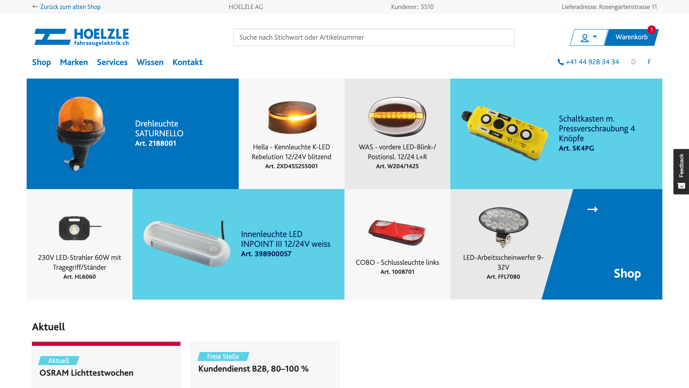
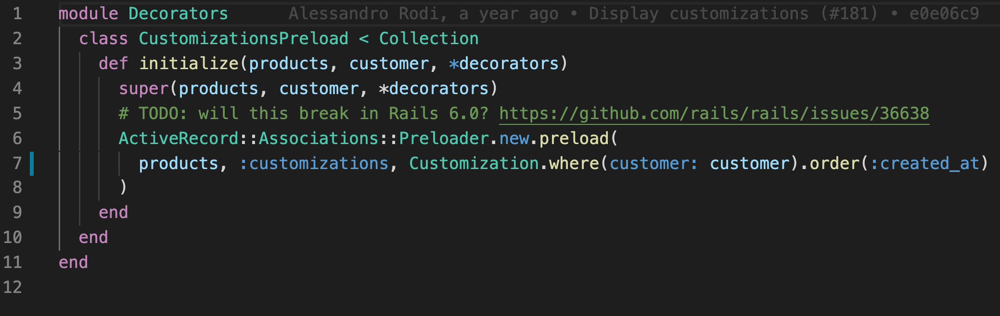

# Rails Meetup 2020

Hoelzle AG
Gregor Wassmann

---



---


---


---


---

[github.com/hoelzle/rails-meetup-2020](https://github.com/hoelzle/rails-meetup-2020)

---

# Agenda

- Decorators vs Concerns
- Surprise

---

You should use…

```ruby
class Price < SimpleDelegator
end
```

---

[Thoughtbot — Evaluating Alternative Decorator Implementations In Ruby](https://thoughtbot.com/blog/evaluating-alternative-decorator-implementations-in)

---

# Decorators

- Module + Extend + Super
- Plain Old Ruby Object (PORO)
- Class + Method Missing
- __SimpleDelegator + Super + Getobj__


---

# Pros

- Encapsulation
- Easily Testable
- Tranparent interface
- Simple
- No dependencies

---

It redefines `class`, but that may be the only drawback…

---

```ruby
class Decorators::Price
class Decorators::SpecialPrice
class Decorators::CustomerDiscountPrice
class Decorators::PromotionPrice
class Decorators::ProductDiscountPrice
class Decorators::GroupDiscountPrice
class Decorators::RegularPrice
```

---



---

```ruby
class ProductsController < ApplicationController
  def index
    @products = Decorators::CustomizationsPreload.new(
      @products, current_customer, Decorators::Price
    )
  end
end

```

---

# Refinements

---

```ruby
module DiscountFactor
  refine Numeric do
    def factor
      1 - self / 100.0
    end
  end
end
```

---

```ruby
module Decorators
  class RegularPrice < Decorators::Context
    using DiscountFactor

    def net_price
      price * discount.factor
    end

    # Omitted code here
  end
end
```

---

# See also

- Draper
- Trailblazer

---

[github.com/hoelzle/rails-meetup-2020](https://github.com/hoelzle/rails-meetup-2020)
